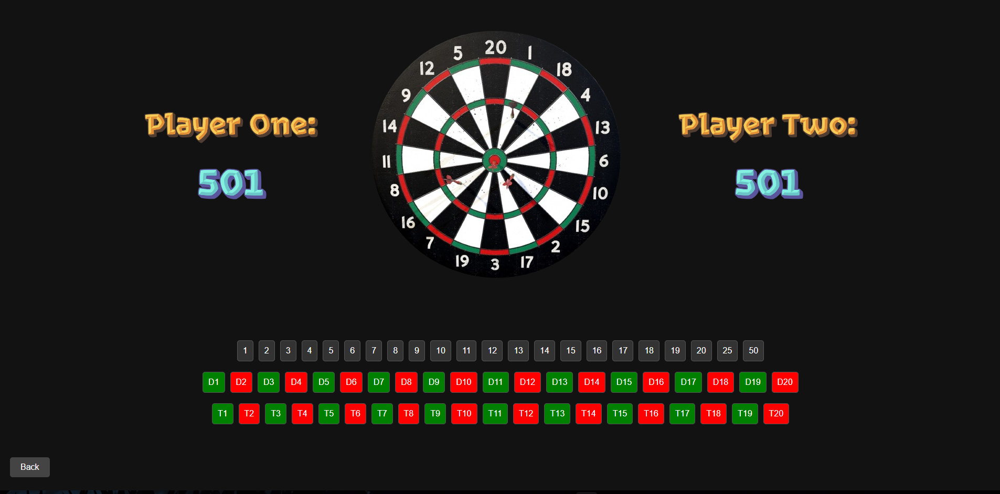

# DartCounter

DartCounter is a Python project that helps you keep track of your dart scores while playing the game of darts.

- Score tracking: Keep track of your scores for each player and each round of the game.

## Installation

1. Clone the repository: `git clone https://github.com/your-username/DartCounter.git`
2. Navigate to the project directory: `cd DartCounter`

## Usage

1. Run the main script: `python web.py`
2. Enjoy playing darts with the help of DartCounter!
